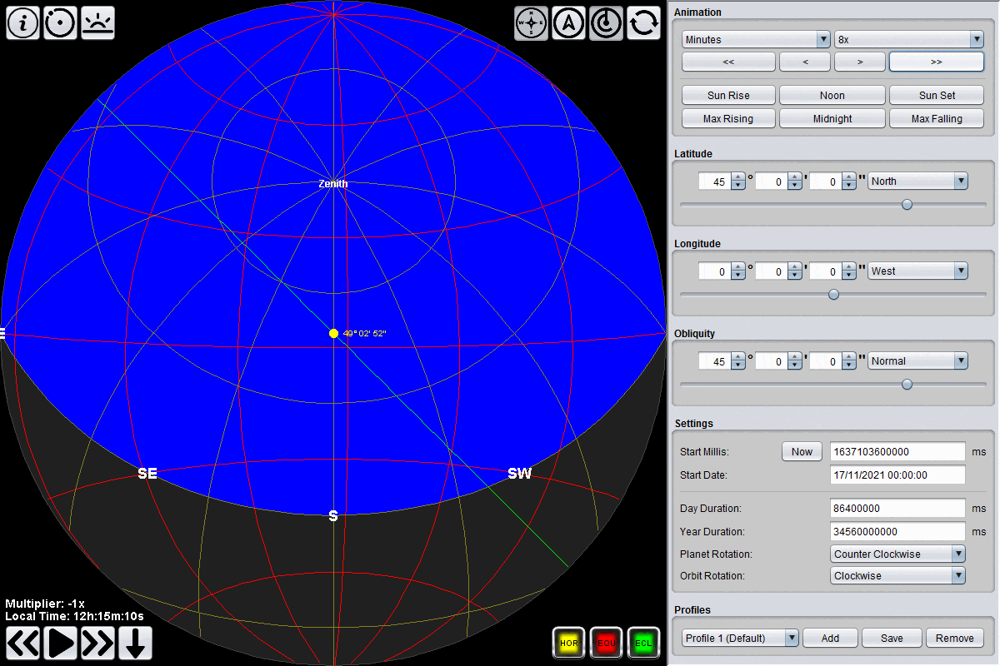
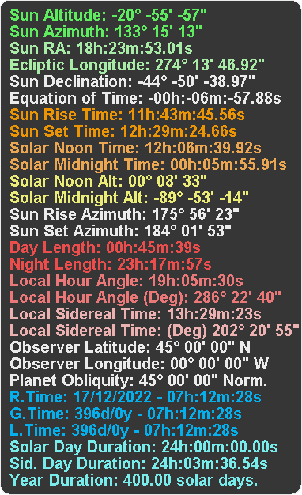

Overview
------------------
AstroCalc is a simple application for simulating a virtual planet in a perfectly circular orbit and the sun's path across the sky.
This application allows users to go beyond the limits of real possibilities during the simulation and change the planet's parameters in a wide range.
The application does not use any graphics engine or external libraries, only pure Java in the simplest way to show the beauty of spherical trigonometry.

Times
------------------
The time in the program begins to flow from the set time **"Start Millis"**. At this point the planet is located precisely at 270� degrees of ecliptic longitude, which means it is at the winter/summer solstice point. It depends on the set obliquity.
The prime meridian is 180� degrees away from the sun, which means solar midnight.
The simulation time begins to run according to the set parameters driven by the system time.

There are time data in the program: **Global Time (GT)**, **Local Time (LT)**, and **Real Time (RT)**. 
**Global Time (GT)** is a 24-hour time format that corresponds to one planet's solar revolution and is always measured at the prime meridian, which is similar to (GMT). 
**Local Time (LT)** is similar to **(GT)** with one difference that **(LT)** is dependent on longitude... The virtual planet does not have time zones like ours, therefore **(LT)** changes smoothly with changing longitude within +- 12h 
**Real Time (RT)** is the actual system time and date, including the time shift made by the user through the (Time Flow) buttons or the Animation panel.
According to this time, it is possible to determine when certain astronomical events of the simulation will occur in real-time.

Time management
------------------
Time can be controlled in two ways: with the Animation box or directly with the (Time Flow) buttons next to the astro map.
In the Animation Panel, it is possible to change the time in a specific time step entered by the user. These time steps are calculated according to the parameters of the planet. Therefore an offset of 1 day
does not necessarily mean a one-day shift in real-time. The millisecond time step is the smallest possible unit of shift used for fine-tuning the time.
The (Time Flow) buttons next to the astro map are used to control the speed of the passage of time. The passage of time can be paused, reversed, accelerated, or returned to time without shifting.
**Time Multiplier** indicates how fast time moves. 1x = normal speed, -1x = time stands still, -2x = reverse flow of time at normal speed.
The flow of time can be changed without limitation based on the user's needs. 
The **Sun Rise** / **Sun Set** buttons are used to set the time of the event that applies to the current day according to local time. 
The **Max Rising** / **Max Falling** buttons are used to set the time of the event when the sun's altitude changes the fastest on a given day according to local time. 
The **Noon** / **Midnight** buttons are available to set solar noon or solar midnight, which means that the sun is then at 180� or 360� degrees of azimuth.
In most cases, this means the Maximum and minimum sun altitude for a given day in **Local Time (LT)**.

Latitude/Longitude
------------------
Latitude and Longitude work the same way on our planet: to set the observer's point.
As the longitude changes, so do the observer's local time.

Obliquity
------------------
Obliquity, also known as axial tilt, is the angle between an object's rotational axis and its orbital axis,
 which is the line perpendicular to its orbital plane; equivalently, it is the angle between its equatorial and orbital planes.
 

Settings
------------------
**Start Millis** is a Unix Timestamp time in milliseconds that determines from what time **(RT)** the simulation in the program starts.
The program calculates the difference between this time and the current system time and determines the time for controlling the simulation. 
**Start Date** is the equivalent of Unix time displayed as a date.
These fields are linked, so one depends on the other and displays the same data in a different time format. 
**Day Duration** is the millisecond time determining how long one solar day lasts on the virtual planet. 
**Year Duration** is the time in milliseconds that determines how long it takes for the virtual planet to complete one revolution around the sun. 
**Planet Rotation** determines the direction in which the virtual planet rotates around its axis. 
**Orbit Rotation** determines the direction in which the virtual planet orbits.

Profiles
------------------
Profiles allow the user to save user settings. The number of profiles is unlimited.
Profiles are saved in the **AstroCalc.cfg** file, which is created in the folder where the AstroCalc program is located.

Info Button
------------------
In this section, the user will find all available planetary information, including the times of various events.

Other functions
------------------
AstroCalc also has a function **ShowOrrery** to display the earth's rotation around the sun. The function shows the current position of the planet in orbit and the current rotation of the planet with respect to the sun.
The red line shows the location of the observer. This display is 2D; therefore, the light beam sometimes deviates from the red line even though the sun is at 180� degrees azimuth.
It depends on the set Obliquity and the current Equation of Time. Therefore, the graphical representation of the planet's rotation is only approximate. 
The **TrackSun** function locks the sun in the center of the astro map, and the view rotates behind the sun.
The **FlipView** function switches between a stereographic view and a view of a spherical sphere from the outside.

Why did I create it?
--------------------
I originally did this program just for myself because I've always been interested in astronomy and wanted to try some new things.
However, I decided to share this program with the public. Maybe there will be someone who will enjoy this program as much as I did and help him to understand more basic principles of astronomy.
